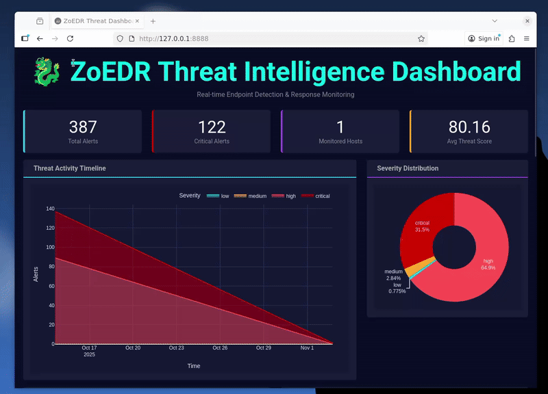
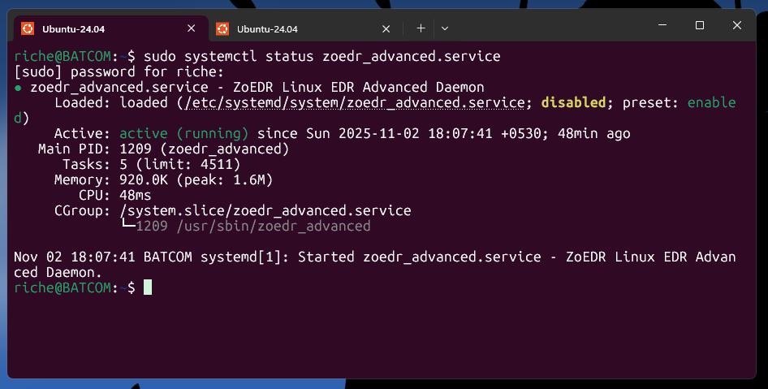

#  ZoEDR-Linux - Advanced Endpoint Detection & Response

> **ZETA REALM SECURITY - Zero-trust Endpoint Detection & Response**

## Dashboard Demo



*Real-time threat intelligence dashboard with live monitoring and advanced visualizations*

---

## Overview

ZoEDR-Linux is a professional-grade endpoint detection and response (EDR) system designed for comprehensive threat monitoring and automated response. Featuring kernel-level persistence, self-healing capabilities, and a modern SOC-grade web dashboard with real-time threat intelligence.

**Built for security professionals. Optimized for Kali Linux.**

---

## Core Features

### Advanced Threat Detection
- **Real-time Process Monitoring** - Complete process tree tracking with behavioral heuristics
- **File Integrity Monitoring** - Critical path watching with `inotify` for modifications, creations, deletions
- **Network Connection Analysis** - Detects suspicious network activity linked to processes
- **Advanced Heuristic Detection** - Identifies crypto miners, reverse shells, privilege escalation, and fileless execution
- **Multi-layered Threat Scoring** - Intelligent threat assessment with severity classification

### Self-Protection & Persistence
- **Binary Integrity Protection** - SHA256 hash verification with automatic recovery
- **Kernel-level Persistence** - Optional deep system monitoring via loadable kernel module
- **Self-healing Watchdog** - Automatically monitors and restarts services if tampered with
- **Immutable Defense** - Auto-recovery mechanisms protect against tampering

### Automated Response
- **Process Quarantine** - Automatic suspension and network isolation for critical threats
- **Real-time Alerting** - Structured JSON alerts with severity classification
- **Threat Intelligence** - Comprehensive logging with correlation and analysis

### Professional Dashboard
- **Real-time Monitoring** - Live threat intelligence with auto-refresh (5-second intervals)
- **7 Advanced Visualizations**:
  - KPI Cards (Total Alerts, Critical Count, Monitored Hosts, Avg Threat Score)
  - Threat Activity Timeline (Area chart with severity coloring)
  - Severity Distribution (Donut chart)
  - Top Attack Vectors (Bar chart)
  - Process Activity Analysis
  - Activity Heatmap (Hour × Day patterns)
  - Most Targeted Hosts Table
- **Modern Cybersecurity Theme** - Dark theme optimized for SOC environments
- **Responsive Design** - Professional card-based layout with FontAwesome icons

### Enterprise Features
- **Robust Logging** - Structured JSON alerts with `logrotate` management
- **Systemd Integration** - Auto-start services with dependency management
- **Multi-Distribution Support** - Debian, Ubuntu, Kali, Fedora, Arch, openSUSE
- **Production Ready** - Gunicorn support for high-performance deployment

---

##  Quick Installation

### Kali Linux (Recommended)

```bash
cd ~/ZoEDR
sudo ./script/install.sh
```

**That's it!** The installer handles everything:
- ✅ Detects and installs all dependencies
- ✅ Handles Kali's Python PEP 668 restrictions automatically
- ✅ Builds userspace daemon with clean compile (zero warnings)
- ✅ Attempts kernel module compilation (optional)
- ✅ Deploys enhanced dashboard with 7 visualizations
- ✅ Configures systemd services for auto-start
- ✅ Sets up log rotation and recovery scripts

### Access Dashboard
```
http://localhost:8888
```
or
```
http://YOUR_IP:8888
```

### Generate Test Data
```bash
cd ~/ZoEDR/Dashboard
python3 generate_sample_alerts.py 1000 /var/log/zoedr/alerts.json
```


---

## 🎯 What Gets Installed

The installation script performs the following:

1. **System Dependencies**
   - Build tools (gcc, make)
   - Libraries (libcurl, openssl)
   - Python 3 and pip
   - Kernel headers (optional, for kernel module)

2. **Python Dashboard Dependencies**
   - dash >= 2.16.0
   - dash-bootstrap-components >= 1.6.0
   - pandas >= 2.0.0
   - numpy >= 1.24.0
   - plotly >= 5.22.0
   - gunicorn >= 21.0.0

3. **ZoEDR Components**
   - Userspace daemon: `/usr/sbin/zoedr_advanced`
   - Kernel module: `/opt/zoedr/zoedr_kernel.ko` (optional)
   - Dashboard: `/opt/zoedr/zoedr_dashboard_advanced.py`
   - Recovery script: `/opt/zoedr/recover.sh`

4. **Directory Structure**
   ```
   /opt/zoedr/              # Installation directory
   /var/log/zoedr/          # Log files
   /etc/zoedr/              # Configuration
   /etc/systemd/system/     # Service files
   ```

5. **Systemd Services**
   - `zoedr_advanced.service` - Main EDR daemon
   - `zoedr_dashboard.service` - Web dashboard

---

## � Dashboard Features

### Live Threat Intelligence
The ZoEDR dashboard provides real-time monitoring with professional-grade visualizations:

#### KPI Cards (Real-time Metrics)
- **Total Alerts** - Overall threat count across all severity levels
- **Critical Alerts** - High-priority incidents requiring immediate attention
- **Monitored Hosts** - Number of unique endpoints being protected
- **Average Threat Score** - Mean threat score across all detected alerts

#### Threat Activity Timeline
- Area chart showing alert volume over time
- Color-coded by severity (Critical, High, Medium, Low, Info)
- 1-minute granularity for precise trend analysis
- Unified hover mode for detailed inspection

#### Severity Distribution
- Donut chart displaying proportion of alerts by severity
- Quick visual assessment of threat landscape
- Percentage breakdown with color coding

#### Top Attack Vectors
- Horizontal bar chart of most common attack types
- Gradient coloring for visual hierarchy
- Top 10 display for focused analysis

#### Process Activity Analysis
- Most flagged processes ranked by alert count
- Helps identify compromised or malicious applications
- Purple accent theme for distinction

#### Activity Heatmap
- Hour × Day temporal pattern analysis
- Identifies peak attack times
- Useful for scheduling maintenance and staffing
- Plasma color scale for intensity visualization

#### Most Targeted Hosts
- Ranked list of endpoints receiving the most alerts
- Shows critical alert counts per host
- Displays average threat scores
- Quick identification of vulnerable systems

#### Live Alert Feed
- Scrolling feed of the latest 50 alerts
- Rich metadata: Host, PID, Process, Severity, Score
- Color-coded severity indicators
- FontAwesome icons for visual clarity
- Expandable details for each alert

### Dashboard Configuration
Edit `/opt/zoedr/zoedr_dashboard_advanced.py`:
```python
ALERT_FILE = "/var/log/zoedr/alerts.json"  # Alert data source
REFRESH_INTERVAL_MS = 5000                  # Refresh every 5 seconds
MAX_ALERTS_DISPLAY = 50                     # Number of alerts in feed
```

### Production Deployment
For high-performance production deployment:
```bash
# Using Gunicorn (recommended)
cd /opt/zoedr
gunicorn -w 4 -b 0.0.0.0:8888 zoedr_dashboard_advanced:server

# Or use systemd service (already configured)
sudo systemctl start zoedr_dashboard.service
```

---

##  Configuration

### Key Files & Directories
- `/etc/zoedr/zoedr_advanced.sha256` - Binary integrity baseline hash
- `/etc/systemd/system/zoedr_advanced.service` - Main daemon service unit
- `/etc/systemd/system/zoedr_dashboard.service` - Dashboard service unit
- `/etc/modules-load.d/zoedr_kernel.conf` - Kernel module auto-load config
- `/etc/logrotate.d/zoedr` - Log rotation configuration
- `/opt/zoedr/` - Installation directory (modules, scripts, dashboard)
- `/usr/sbin/zoedr_advanced` - Main EDR daemon executable
- `/var/log/zoedr/alerts.json` - Real-time threat alerts (JSON format)

### Log Locations
- **Alert Log**: `/var/log/zoedr/alerts.json` - Structured JSON alerts read by dashboard
- **System Logs**: `journalctl -u zoedr_advanced.service` - Daemon logs
- **Dashboard Logs**: `journalctl -u zoedr_dashboard.service` - Dashboard logs
- **Kernel Module**: `dmesg | grep zoedr_kernel` - Kernel module messages

### Firewall Configuration
To access dashboard from remote machines:
```bash
# UFW (Ubuntu/Debian/Kali)
sudo ufw allow 8888/tcp
sudo ufw reload

# firewalld (Fedora/RHEL)
sudo firewall-cmd --permanent --add-port=8888/tcp
sudo firewall-cmd --reload

# iptables
sudo iptables -A INPUT -p tcp --dport 8888 -j ACCEPT
```

---

##  Service Management



*Both daemon and dashboard services running in production*

### Start/Stop/Status Services
```bash
# Main EDR Daemon
sudo systemctl start zoedr_advanced.service
sudo systemctl stop zoedr_advanced.service
sudo systemctl status zoedr_advanced.service
sudo systemctl restart zoedr_advanced.service

# Web Dashboard
sudo systemctl start zoedr_dashboard.service
sudo systemctl stop zoedr_dashboard.service
sudo systemctl status zoedr_dashboard.service
sudo systemctl restart zoedr_dashboard.service
```

### View Logs (Live)
```bash
# Daemon logs
sudo journalctl -u zoedr_advanced.service -f

# Dashboard logs
sudo journalctl -u zoedr_dashboard.service -f

# Alert log
tail -f /var/log/zoedr/alerts.json

# View both services
sudo journalctl -u zoedr_advanced.service -u zoedr_dashboard.service -f
```

### Enable/Disable Auto-start
```bash
# Enable auto-start on boot
sudo systemctl enable zoedr_advanced.service
sudo systemctl enable zoedr_dashboard.service

# Disable auto-start
sudo systemctl disable zoedr_advanced.service
sudo systemctl disable zoedr_dashboard.service
```

### Quick Health Check
```bash
# Check if services are active
sudo systemctl is-active zoedr_advanced.service
sudo systemctl is-active zoedr_dashboard.service

# Check if dashboard is accessible
curl http://localhost:8888

# View recent alerts
tail -n 20 /var/log/zoedr/alerts.json
```

---

##  Threat Detection Capabilities

ZoEDR uses advanced heuristics to detect various threat categories:

### Detection Categories

####  Crypto Miners
- CPU usage pattern analysis
- Known miner binary signatures
- Mining pool connection detection
- Sustained high CPU utilization

####  Reverse Shells
- Correlated network activity with shell processes
- Suspicious parent-child process relationships
- Non-standard shell invocations
- Outbound connections from unexpected processes

####  Privilege Escalation
- Unexpected root process spawning
- SUID/SGID bit exploitation attempts
- Capability abuse detection
- Unauthorized sudo usage patterns

####  Fileless Execution
- Processes running from memory-only locations (`/dev/shm`, `/tmp`)
- Script execution without disk persistence
- Living-off-the-land binary (LOLBin) abuse
- Process injection techniques

####  Binary Tampering
- Real-time SHA256 hash verification
- Self-integrity monitoring
- Automatic detection of ZoEDR binary modification
- Triggered recovery procedures

####  File System Events
- Creation, modification, deletion monitoring
- Attribute change detection
- Critical path watching (`/bin`, `/usr/bin`, `/etc`, `/root`, `/home`)
- Real-time inotify-based monitoring

### Threat Scoring System

Alerts are assigned threat scores (0-100+) based on multiple factors:

| Score Range | Severity | Description | Response |
|------------|----------|-------------|----------|
| 0-9 | **INFO** | Informational events | Logged only |
| 10-39 | **LOW** | Suspicious activity | Monitored |
| 40-69 | **MEDIUM** | Alert triggered | Enhanced monitoring |
| 70-89 | **HIGH** | Significant threat | Auto-quarantine |
| 90-100+ | **CRITICAL** | Severe breach | Auto-recovery |

### Automated Response Actions

When threats exceed severity thresholds:

1. **Process Quarantine** (Score ≥ 70)
   - Process suspension via SIGSTOP
   - Network isolation
   - Alert generation

2. **Self-Recovery** (Score ≥ 90)
   - Binary integrity restoration
   - Service restart
   - Kernel module reload
   - Alert to SOC team

---

##  Recovery & Maintenance

### Automated Recovery
ZoEDR includes a self-healing watchdog that automatically:
- ✅ Monitors daemon integrity
- ✅ Restarts failed services
- ✅ Reloads kernel modules if unloaded
- ✅ Verifies binary hash every 15 seconds
- ✅ Triggers recovery on tampering

### Manual Recovery
If manual intervention is needed:
```bash
sudo /opt/zoedr/recover.sh
```

The recovery script will:
1. Stop all ZoEDR services
2. Verify and restore binary from backup
3. Reload kernel module
4. Restart services
5. Verify system health

### Integrity Verification
Manually verify binary integrity:
```bash
# Check current hash against baseline
sudo ./script/verify_hash.sh

# View baseline hash
cat /etc/zoedr/zoedr_advanced.sha256

# Manually compute current hash
sha256sum /usr/sbin/zoedr_advanced
```

### Complete Reinstall
For a full system reset:
```bash
# Uninstall completely
sudo ./script/uninstall.sh

# Fresh installation
sudo ./script/install.sh
```

### Service Reset
```bash
# Stop all services
sudo systemctl stop zoedr_advanced.service
sudo systemctl stop zoedr_dashboard.service

# Unload kernel module
sudo rmmod zoedr_kernel 2>/dev/null || true

# Reload systemd
sudo systemctl daemon-reload

# Restart services
sudo systemctl start zoedr_advanced.service
sudo systemctl start zoedr_dashboard.service
```

### Log Management
```bash
# View log size
du -sh /var/log/zoedr/

# Manually rotate logs
sudo logrotate -f /etc/logrotate.d/zoedr

# Clear old logs (careful!)
sudo rm /var/log/zoedr/alerts.json.*.gz
```

---

##  Monitoring & Testing

### System Health Dashboard
Monitor ZoEDR status in real-time:
```bash
# Service status
systemctl status zoedr_advanced.service
systemctl status zoedr_dashboard.service

# Quick health check
sudo systemctl is-active zoedr_advanced.service zoedr_dashboard.service

# Kernel module status
lsmod | grep zoedr_kernel

# Recent alerts
tail -f /var/log/zoedr/alerts.json

# Web dashboard
curl -I http://localhost:8888
```

### Testing & Validation
```bash
# Run comprehensive system tests
sudo ./script/test.sh

# Generate sample alerts for testing
cd ~/ZoEDR/Dashboard
python3 generate_sample_alerts.py 1000 /var/log/zoedr/alerts.json

# Watch alerts being generated
watch -n 1 'tail -n 5 /var/log/zoedr/alerts.json'
```

### Performance Monitoring
```bash
# CPU and memory usage
ps aux | grep zoedr

# Service resource usage
systemctl status zoedr_advanced.service | grep Memory
systemctl status zoedr_dashboard.service | grep Memory

# Network connections
sudo netstat -tulpn | grep zoedr
sudo ss -tulpn | grep 8888
```

### Alert Analysis
```bash
# Count total alerts
wc -l /var/log/zoedr/alerts.json

# Count by severity
grep -o '"severity":"[^"]*"' /var/log/zoedr/alerts.json | sort | uniq -c

# View critical alerts only
grep '"severity":"critical"' /var/log/zoedr/alerts.json | jq

# Recent high-severity alerts
grep -E '"severity":"(critical|high)"' /var/log/zoedr/alerts.json | tail -10 | jq
```

---


### Quick Fixes

#### Services Won't Start
```bash
# Check logs for errors
sudo journalctl -u zoedr_advanced.service -n 50 --no-pager
sudo journalctl -u zoedr_dashboard.service -n 50 --no-pager

# Verify binary exists and is executable
ls -l /usr/sbin/zoedr_advanced
ls -l /opt/zoedr/zoedr_dashboard_advanced.py

# Check dependencies
gcc --version
python3 --version
python3 -c "import dash, plotly, pandas"
```

#### Dashboard Not Accessible
```bash
# Verify dashboard is running
sudo systemctl status zoedr_dashboard.service

# Check if port is listening
sudo netstat -tulpn | grep 8888

# Test locally
curl http://localhost:8888

# Check firewall
sudo ufw status
sudo ufw allow 8888/tcp

# Restart dashboard
sudo systemctl restart zoedr_dashboard.service
```

#### No Alerts Generated
```bash
# Verify daemon is running
sudo systemctl status zoedr_advanced.service

# Check log file permissions
ls -la /var/log/zoedr/alerts.json

# View daemon logs
sudo journalctl -u zoedr_advanced.service -f

# Generate test alerts
cd ~/ZoEDR/Dashboard
python3 generate_sample_alerts.py 500 /var/log/zoedr/alerts.json
```

#### Kernel Module Issues
```bash
# Check if headers are installed
ls /lib/modules/$(uname -r)/build

# Install headers (Kali/Debian)
sudo apt-get install linux-headers-amd64

# Try loading module manually
sudo insmod /opt/zoedr/zoedr_kernel.ko

# Check kernel logs
dmesg | grep zoedr_kernel
```

#### Python Dependency Errors (Kali Linux)
```bash
# Install with --break-system-packages flag
sudo pip3 install dash dash-bootstrap-components pandas plotly numpy --break-system-packages

# Verify installation
python3 -c "import dash, plotly, pandas, numpy; print('OK')"

# Restart dashboard
sudo systemctl restart zoedr_dashboard.service
```

### Common Error Messages

| Error | Cause | Solution |
|-------|-------|----------|
| `ModuleNotFoundError: No module named 'dash'` | Missing Python deps | Install with pip3 --break-system-packages |
| `Failed to start zoedr_advanced.service` | Binary missing or corrupt | Run `sudo ./script/install.sh` |
| `Connection refused on port 8888` | Dashboard not running | Check logs with `journalctl -u zoedr_dashboard.service` |
| `insmod: ERROR: could not load module` | Kernel headers missing | Install linux-headers-amd64 (optional) |
| `Permission denied` on alert log | Wrong permissions | Run `sudo chmod 644 /var/log/zoedr/alerts.json` |

---


##  Development & Architecture

### Project Structure
```
ZoEDR/
├── assets/
│   ├── ZoERD-Dashboard.mp4      # Dashboard demo video
│   └── ZoEDR-Service.png        # Service status screenshot
├── src/
│   ├── zoedr_advanced.c         # Main monitoring daemon (clean build)
│   ├── zoedr_common.h           # Shared structures & constants
│   └── zoedr_kernel.c           # Kernel module (optional)
├── script/
│   ├── install.sh               # Comprehensive deployment (multi-distro)
│   ├── uninstall.sh             # Complete removal script
│   ├── verify_hash.sh           # Manual integrity verification
│   ├── test.sh                  # System testing script
│   ├── recover.sh               # Automated recovery
│   └── setup_directories.sh     # Directory initialization
├── Dashboard/
│   ├── zoedr_dashboard_advanced.py  # Enhanced web dashboard
│   ├── generate_sample_alerts.py    # Test data generator
│   ├── start_dashboard.sh           # Linux quick-start
│   ├── start_dashboard.ps1          # Windows quick-start
│   ├── sample_alerts.json           # Sample data
│   ├── README.md                    # Dashboard documentation
│   
├── config/
│   ├── zoedr.service            # systemd service template
│   └── zoedr.logrotate          # logrotate configuration
├── Makefile                     # Kernel module build system
├── requirements.txt             # Python dependencies
├── README.md                    # This file


```

### Technology Stack

**Backend (C)**
- POSIX threads for concurrent monitoring
- inotify for file system events
- OpenSSL EVP API for cryptography (SHA256)
- libcurl for potential future integrations
- procfs for process monitoring

**Dashboard (Python)**
- Dash >= 2.16.0 - Web framework
- Plotly >= 5.22.0 - Interactive visualizations
- Pandas >= 2.0.0 - Data processing
- NumPy >= 1.24.0 - Numerical operations
- Bootstrap components for UI

**System Integration**
- systemd for service management
- logrotate for log management
- Kernel module (optional) for deep monitoring

### Code Quality

**Compiler Warnings: ZERO** ✅
- Fixed unused parameter warnings
- Migrated from deprecated OpenSSL SHA256 API to modern EVP API
- Resolved buffer truncation warnings
- Clean build with `-Wall -Wextra`

**Security Practices**
- SHA256 integrity verification
- Secure memory handling
- Input validation
- Thread-safe operations
- Proper error handling

### Building from Source

#### Prerequisites
```bash
# Kali/Debian/Ubuntu
sudo apt-get update
sudo apt-get install build-essential libcurl4-openssl-dev libssl-dev linux-headers-amd64 python3 python3-pip

# Fedora/RHEL
sudo dnf install gcc make kernel-devel libcurl-devel openssl-devel python3 python3-pip

# Arch
sudo pacman -S base-devel linux-headers curl python python-pip
```

#### Manual Build
```bash
# Clone repository
git clone https://github.com/RicheByte/ZoEDR.git
cd ZoEDR

# Build userspace daemon
gcc -o zoedr_advanced src/zoedr_advanced.c -lpthread -lcurl -lcrypto -O2 -Wall -Wextra -Isrc/

# Build kernel module (optional)
make

# Install Python dependencies
pip3 install -r requirements.txt --break-system-packages

# Deploy
sudo ./script/install.sh
```

### Contributing

When contributing to ZoEDR:
1. **Maintain clean builds** - No compiler warnings
2. **Follow code style** - Consistent formatting
3. **Test thoroughly** - Run test.sh before committing
4. **Update documentation** - Keep README in sync
5. **Security first** - Review for vulnerabilities

### API Reference

**Alert JSON Format:**
```json
{
  "timestamp": "2025-11-02 14:30:45",
  "host": "kali-linux",
  "alert_type": "PROCESS_INJECTION",
  "pid": 1234,
  "process_name": "suspicious.exe",
  "threat_score_total": 85,
  "severity": "high",
  "details": "Suspicious process injection detected"
}
```

**Severity Levels:**
- `info` (0-9)
- `low` (10-39)
- `medium` (40-69)
- `high` (70-89)
- `critical` (90-100+)

---

## 🚀 Performance & Scalability

### Resource Usage
- **CPU**: ~1-3% during normal operation
- **Memory**: ~50-100MB for daemon, ~150-200MB for dashboard
- **Disk I/O**: Minimal (JSON append-only logging)

### Optimization Tips
```python
# Dashboard performance tuning (edit zoedr_dashboard_advanced.py)
REFRESH_INTERVAL_MS = 10000  # Reduce refresh frequency (10 seconds)
MAX_ALERTS_DISPLAY = 25      # Display fewer alerts
```

### Production Deployment
```bash
# Use Gunicorn for better performance
gunicorn -w 4 -b 0.0.0.0:8888 zoedr_dashboard_advanced:server

# Or configure in systemd service
# Already configured: /etc/systemd/system/zoedr_dashboard.service
```

### Scalability
- Handles 1000+ alerts per day efficiently
- Log rotation prevents disk space issues
- Dashboard optimized for datasets up to 100K alerts


---

##  Security Considerations

### Threat Model
ZoEDR is designed to detect and respond to:
- ✅ Malicious processes and binaries
- ✅ Unauthorized privilege escalation
- ✅ Network-based attacks
- ✅ Fileless malware
- ✅ System tampering

### Limitations
- ⚠️ Runs with root privileges (required for kernel-level monitoring)
- ⚠️ Not a replacement for comprehensive security suite
- ⚠️ Best used as part of defense-in-depth strategy

### Best Practices
1. Keep ZoEDR updated
2. Monitor dashboard regularly
3. Review critical alerts promptly
4. Integrate with SIEM if available
5. Regular integrity checks
6. Backup configuration and baseline hashes

---

##  License & Legal

**ZETA REALM USE ONLY**  
This system is designed for educational and research purposes. Use responsibly and in accordance with applicable laws.

### Disclaimer
- No warranty provided
- Use at your own risk
- Authors not responsible for misuse
- Intended for authorized security testing only

---

##  Support & Community

### Getting Help
1. Check **[INSTALL_TROUBLESHOOTING.md](INSTALL_TROUBLESHOOTING.md)**
2. Review logs: `journalctl -u zoedr_advanced.service`
3. Open an issue on GitHub
4. Review existing issues for solutions

### Reporting Bugs
When reporting issues, include:
- Distribution and version: `cat /etc/os-release`
- Kernel version: `uname -r`
- Python version: `python3 --version`
- Error logs: `journalctl -u zoedr_advanced.service -n 100`
- Installation logs
- Steps to reproduce

### Feature Requests
We welcome feature requests! Please open an issue with:
- Clear description of the feature
- Use case and benefits
- Potential implementation approach

---

##  Roadmap

### Upcoming Features
- [ ] Email/SMS alert notifications
- [ ] Machine learning-based anomaly detection
- [ ] Enhanced network traffic analysis
- [ ] Container runtime security
- [ ] Multi-tenancy support
- [ ] REST API for external integrations
- [ ] Alert correlation engine
- [ ] Threat intelligence feed integration

### In Progress
- [x] Enhanced dashboard (COMPLETED)
- [x] Multi-distribution support (COMPLETED)
- [x] Clean build with zero warnings (COMPLETED)
- [x] Kali Linux optimization (COMPLETED)

---

##  Statistics

**Project Stats:**
- Lines of Code: ~600+ (C daemon) + ~650+ (Python dashboard)
- Visualizations: 7 professional charts
- Supported Distributions: 6+ (Debian, Ubuntu, Kali, Fedora, Arch, openSUSE)
- Detection Categories: 6 threat types
- Compiler Warnings: 0 (Clean build)

---

##  Acknowledgments

Built with:
- **C** - High-performance monitoring
- **Python** - Data visualization and analysis
- **Dash** - Interactive web framework
- **Plotly** - Professional charting
- **OpenSSL** - Cryptographic operations
- **systemd** - Service management

---

**🐉 ZoEDR - Zero-trust Endpoint Detection & Response**  
**ZETA REALM SECURITY - Professional SOC-Grade EDR**  
*Maintained by RicheByte*

---

## Version History

### v2.0 (Current) - Enhanced Dashboard Edition
- ✅ 7 professional visualizations
- ✅ Modern cybersecurity theme
- ✅ Multi-distribution support
- ✅ Clean build (zero warnings)
- ✅ Kali Linux optimization
- ✅ Comprehensive documentation

### v1.0 - Initial Release
- ✅ Core EDR framework
- ✅ Basic monitoring capabilities
- ✅ Foundation for advanced features

